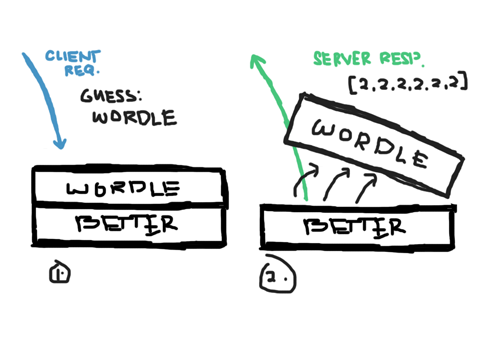

# WordleBattleAPI

WordleBattleAPI is a very basic python API project where you can play wordleBattle and compete with others by earning points. Users can earn points by answering as many questions as they can, further information about the game (that is similar to wordle) will be explained [here](#game-mechanics).

Installation:

`~$ pip install flask`

Usage:

`~$ python3 main.py <APIServerAddress> <APIServerPort>`

Example:

`~$ python3 main.py 10.0.0.22 5454`

<br/>

# Basic Implementation

The Webpage codes must be added to the directory `/static_files` so all the HTML, CSS, and JS files can be accessed through the API server. Also, so that we can use `wordlelib.js`.

All the processes in this API are designed to be implemented in JavaScript and instead of providing the lower level logic behind the API, we packed all of the logic into higher level JavaScript library called `wordlelib.js`. For further details wordlelib.js can be seen [here](.).

For now, basic registeration, login, and answer guessing can be done by:

```javascript
// requests for token (for session) and
// establishes handshake for the key (encrypted comms)
tokenRegister();
handshake();

// REGISTERS the supplied username and password
registerCreds('example_username', 'example_password', undefined, (response) => {
	if (response === 'successful') {
		// credentials are registered
	} else {
		// invalid credentials (username already exists)
	}
});

// LOGIN the supplied credentials
loginCreds('example_username', 'example_password', undefined, (response) => {
	if (response === 'sucessful') {
		// logs in w/out problem/s
	} else {
		// invalid username/password
	}
});

// GUESS the word provided by the server (in this case we use: Wordle as answer)
userGuess('wordle', (response) => {
	// response is an array that contains the
	// info about the answer. (ex. [0,0,1,0,0,1])
});
```

### The userGuess **response status**

The array in response, as said, contains the information about the user's answer. The value of the nth element in the array corresponds to the status of the nth character of the answer. The status has the ff. meaning:
-	0 - the character is not used in the correct answer.
-	1 - the character is used in the correct answer but IS NOT in proper place.
-	2 - the character is used in the correct answer and IS on proper place.

in some cases, the response returns different array value which also has different meaning:
-	[] - empty array means that the user is either not logged in properly, or the token is not registered. (you can re-use the `tokenRegister()` and `handshake()`, and login the account again to resolve this issue)
-	[-1] - this means that all the words in the in the current account are already been solved (this will happen if there are less words listed in sample.txt).
-	[-2] - this means that the max attempt to guess the word has already done. If this occured, we can let the user answer the same words in the wordlist but shuffled by calling the function: `shuffleWordlist(callback=(response) => {})`. 'response' returns '1' if the shuffle is executed correctly (no errors).

**NOTE:** If the word is guessed correctly (results in array with all 2s as content [2,2,2,...]), the server will automatically pops the old word from the list, so the next guess attempts that will be done will be registered on the next word from the list.



<br/>

Saving the code above as whatever.js, on `/static_files` directory and implementing it on html:

```html
<head>
	<script src="./jslib/wordlelib.js"></script>
	<script src="./whatever.js"></script>
</head>
```

# Game Mechanics

WordleBattle is obviously similar to the game [Wordle](https://www.nytimes.com/games/wordle/index.html) where you have to guess a word and if you guess the wrong answer, the game provides you a hint which letters in your answer provided is: 1.) correct but in wrong position 2.) in correct position 3.) not used.

In WordleBattle, each guessed answer counts a point and this point will be registered in your account. Gaining more points give you more trophy thus, placing you higher in the scoreboard. Yes... That's just it.

<br/>

# Why make this game?

This game was made by us just for fun (jk, we struggling af), to apply different design patterns in python, and of course, as final project to our Advanced OOP.

Other than these, the game also introduces some poor security (weak encryption and so on), so feel free to check, exploit, learn to sniff, reverse engineer, and have fun from the game!

<br/>

# Authors
- Amatus, Angelika T.
- Espinola I, Hubert F.